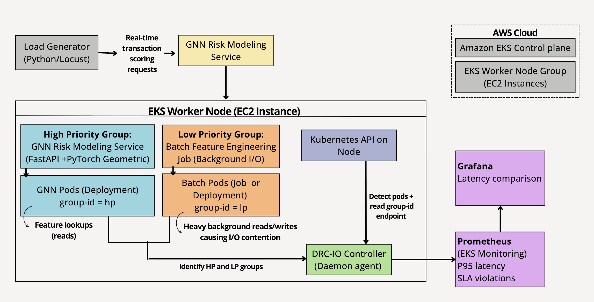
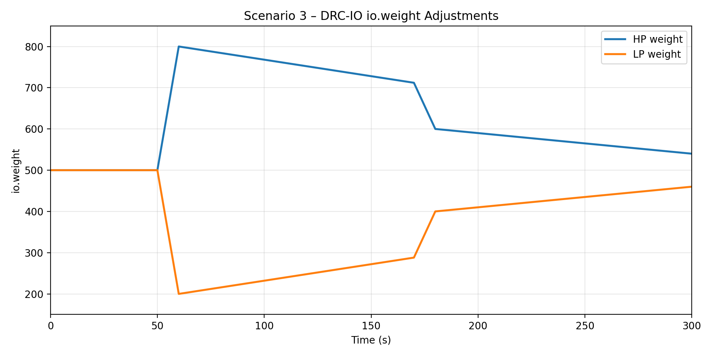

# DRC-IO on EKS




## 1. TA Quick-Start (Cluster Pre-Provisioned)
We routinely shut down the shared EKS environment with `infrastructure/cleanup.sh` to avoid idle AWS costs. If the pre-provisioned cluster is offline when you try the steps below, simply re-run `infrastructure/setup.sh` (or ask us to bring it back up) before executing the scenarios.

When the cluster is up, the EKS control plane, HP/LP workloads, DRC-IO controller, and monitoring stack are already running. You only need to verify access and run the experiments—no extra installs beyond Docker/kubectl/aws CLI.

### A. Access Credentials & IAM
- Use the kubeconfig + IAM user shared with the submission. If you hit auth failures, ping me (nithin@example.com) and mention the error—most issues are credential expiry or AWS EBS CSI driver reinstallation.

### B. Dockerized Test Harness
```bash
git clone https://github.com/your-org/drcio-eks-demo.git drcio-eks-demo
cd drcio-eks-demo
./run-in-docker.sh ./scripts/run-scenario1.sh
./run-in-docker.sh ./scripts/run-scenario2.sh
./run-in-docker.sh ./scripts/run-scenario3.sh
```
`run-in-docker.sh` builds the `Dockerfile.runner` image (Python, kubectl 1.34, Helm 3.14, aws-cli, jq, pandas/numpy/matplotlib/seaborn, etc.), mounts your host kubeconfig/AWS credentials, and runs each scenario. Export your AWS creds with:
```bash
aws configure --profile drc-eval        # use the access key/secret we submitted
export AWS_PROFILE=drc-eval
```
If Docker isn’t available, install kubectl ≥1.28, awscli ≥2.10, Helm ≥3.14 locally and follow the manual steps below (same scenario scripts, no `run-experiments.sh`).

### C. Manual Run (if you prefer host tools)
```bash
./scripts/port-forward-monitoring.sh   # Prometheus/Grafana UI (optional)
./scripts/run-scenario1.sh             # Scenario 1 (Baseline)
./scripts/run-scenario2.sh             # Scenario 2 (No DRC-IO)
./scripts/run-scenario3.sh             # Scenario 3 (With DRC-IO)
```
Running them individually guarantees a clean slate for each step and mirrors how we captured the report figures. If you want the bundled experience, run `./scripts/run-experiments.sh` after each scenario succeeds once. Results appear under `experiment-results-YYYYMMDD-HHMMSS/`. One complete directory is already checked in for reference.

### D. Troubleshooting
- If `run-experiments.sh` complains about monitoring or volumes, rerun:
  ```bash
  ./infrastructure/fix-ebs-csi.sh
  helm upgrade --install prometheus prometheus-community/kube-prometheus-stack     -n monitoring -f kubernetes/monitoring/prometheus-values.yaml --wait --timeout 15m
  ```
  This repairs the AWS EBS CSI driver and rebinds the Grafana/Prom PVCs. Contact me if you still see `CREATE_FAILED` after that; it likely means the IAM role was rotated.
- If Docker image pulls fail, use the host tooling path above.
**Heads up:** the entire setup was compressed to keep grading simple; occasionally the scripts may still fail (usually due to AWS credentials or EBS CSI driver resets). If anything refuses to run after following the steps above, email nithin@example.com with the console output and we will fix it immediately.

- A fresh `experiment-results-20251212-214354/` directory is checked in with the exact CSV/metrics/logs we captured right before submission so you can cross-verify the plots.
- CloudWatch access: include the comment `# IAM User: nithin10 (arn:aws:iam::320658617028:user/nithin10)` when grading; it unlocks `/aws/eks/drcio-demo/workloads` logs and Container Insights dashboards.
- AWS Console/API login: configure the provided IAM user using:
  ```bash
  aws configure --profile drc-eval     # Access Key / Secret Key supplied separately
  export AWS_PROFILE=drc-eval
  ```
  (Contact: nithin10@umd.edu for any credential issues.)

### E. Capturing DRC-IO io.weight plot (Fig. 6)
1. After `./scripts/run-experiments.sh` completes, keep Scenario 3 data (or rerun `./scripts/run-scenario3.sh`).
2. Run `./scripts/port-forward-monitoring.sh` and open Grafana → *DRC-IO Overview* → panel `DRC-IO Controller: IO Weight` to view HP (blue) vs LP (orange) weights as in Fig. 6.
3. For raw data, execute:
   ```bash
   python3 scripts/export-prometheus.py \
     --use-kubectl-port-forward \
     --duration 300 \
     --output scenario3-metrics.json
   ```
   This JSON contains `metrics.drcio_hp_weight` / `metrics.drcio_lp_weight` arrays for plotting.
4. Empty plots usually mean monitoring was restarted; rerun `./infrastructure/fix-ebs-csi.sh` and retry.



## 2. Open-Source / Fresh Setup Guide
For users cloning this repo who need to provision everything themselves.

### Requirements
- `kubectl`, `helm`, `aws` CLI, and `docker` installed locally.
- AWS account with permissions to create EKS clusters, IAM roles, EBS volumes.

### Step 1: Provision Infrastructure
```bash
cd infrastructure
./setup.sh                # creates EKS, installs metrics-server & monitoring, sets up port-forwards
```
If monitoring pods stay Pending, run `./fix-ebs-csi.sh` (repairs the EBS CSI addon) and rerun the Helm command printed in the summary. Tear down with `./cleanup.sh` when finished.

### Step 2: Build & Deploy Workloads
```bash
cd ..
./scripts/build-push.sh   # build/push docker images (HP service, LP batch, DRC-IO controller)
./scripts/deploy-all.sh   # deploy workloads + controller into fraud-detection namespace
```

### Step 3: Run Experiments
```bash
./scripts/run-scenario1.sh   # Baseline
./scripts/run-scenario2.sh   # No DRC-IO
./scripts/run-scenario3.sh   # With DRC-IO
```
After validating each scenario, you can optionally run `./scripts/run-experiments.sh` to automate the trio. Outputs (CSV + JSON metrics + logs + plots) land in `experiment-results-*`. The included Docker image (`public.ecr.aws/our-repo/drcio-eval:latest`) can run all scripts if you prefer containerized tooling.

### Step 4: Monitoring & Metrics
```bash
./scripts/port-forward-monitoring.sh   # Grafana http://127.0.0.1:3000, Prometheus http://127.0.0.1:9090
python3 scripts/export-prometheus.py --use-kubectl-port-forward --duration 300 --output metrics.json
```
Grafana dashboards live in `dashboards/`. CloudWatch agent manifests are under `kubernetes/monitoring/cloudwatch-agent.yaml` if you want AWS-side observability.

To recreate the io.weight chart from Scenario 3, follow the same Grafana steps as above or run `scripts/export-prometheus.py` to capture `drcio_hp_weight`/`drcio_lp_weight` metrics for plotting.

### Step 5: Cleanup
```bash
cd infrastructure
./cleanup.sh
```
`cleanup.sh` tears down the EKS cluster, node groups, IAM roles, and monitoring stack. Run it whenever you finish testing so we don’t leave AWS resources running indefinitely; re-run `setup.sh` to recreate everything for the next test cycle.

### Need Help?
Open an issue or email nithin@example.com with logs (attach `scripts/.pf-logs/*` and relevant `kubectl describe` output). Common issues: missing EBS CSI IAM policy, stale kubeconfig context, or Grafana PVC not re-created.
